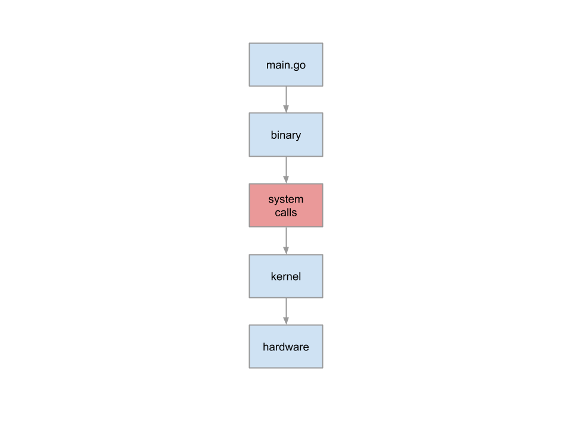

# Introduction

In spite of being a long time Linux user, I have shied away from system calls, `strace`, and the likes. I have
always been afraid of going into the depths of things that have fascinated me.

My understanding of system calls is as quite high level. In my head, system calls are the functions called by 
programs written in high-level programming language to communicate with the kernel space, which in turn talks with 
the hardware, to help print the contents of the file when we do something like:

```shell
$ cat filename
Hello, world
```

Diagrammatically, the picture in my head looks like this:



Through this book I'll try to learn more about system calls, and write what I understood, perceived and grasped 
about them in my own words (and sometimes diagrams.)